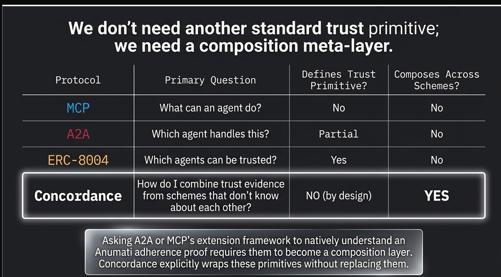
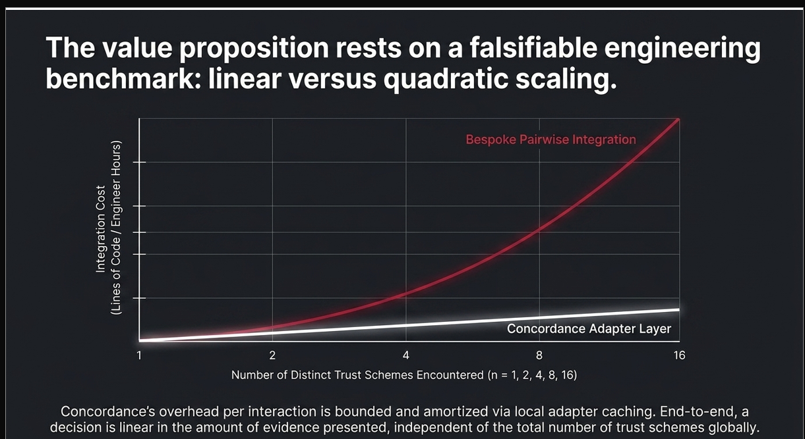
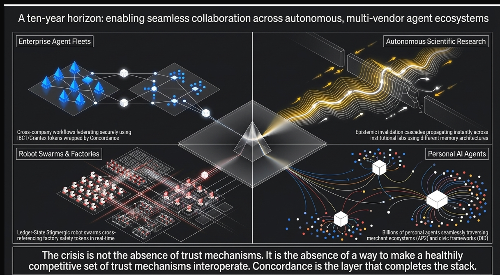

# Concordance

Concordance is a research reference implementation for composing signed trust
evidence across independently evolving agent ecosystems. It does not replace
native trust schemes or prescribe a universal decision policy.
# Core Doc & Research 
## 1. CONCORDANCE 
### A New Protocol Family for Cross-Ecosystem Trust Composition in Autonomous Agent Networks

**Prepared:** July 29, 2026
**Methodology:** `agent-protocol-research` (custom research skill, see accompanying methodology note)
 [CONCORDANCE](docs/doc_core/concordance_research.md)
 
 
 
 

## Status

The repository implements the deterministic, synthetic MVP: signed Trust
Object Envelopes (TOEs), manifest negotiation, typed policies, synthetic
reputation and consent adapters, correlation-aware composition, revocation,
simulation, and an integration-cost benchmark. It is **not** a production trust
authority.

The active build focus is to close the still-open evidence gates for Phase 2
and Phase 3:

- Phase 2 already has the deterministic simulator, CSV result contract, and
  integration-count benchmark, but still requires published measured
  adapter-effort evidence before the phase can be considered closed.
- Phase 3 already has signed adapter announcements, fixture-based conformance,
  and ERC-8004 plus placeholder capability adapters, but still requires
  external validation against independently maintained or live-derived fixtures.
- Phase 4 service and federation work remains deferred until those two evidence
  gates are met.

## Quick start

```powershell
cargo test --workspace
cargo run -p concordance-simulator -- --agents 1000 --max-schemes 3 --adversarial-percent 10 --format csv
cargo run -p concordance-benchmarks -- --format csv
```

`concordance inspect <bundle.json>` prints a serialized evidence bundle.

## Roadmap pointers

See [the protocol specification](docs/protocol-spec.md) and
[the development roadmap](Dev_Phase.md) for normative rules and phase gates.

- [Phase 2 evaluation contract](docs/phase-2-evaluation.md): required
  synthetic scenario matrix plus the measured adapter-effort artifact needed to
  close the benchmark phase.
- [Phase 3 pilot plan](docs/phase-3-pilot.md): pilot harness boundary,
  Anumati target selection, and the conformance evidence required before
  interoperability can be claimed.
- [Adapter contract](docs/adapter-spec.md): fixture, conformance-report, and
  reproducibility rules for phase-3 adapters.
