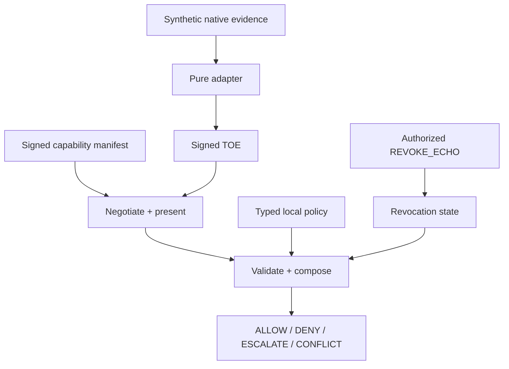

# Reference architecture

The core crate owns the pure protocol operations. The CLI displays an existing
bundle. The simulator drives a deterministic two-agent lifecycle and synthetic
network scenarios. The registry and reference server are intentionally not part
of this MVP.
