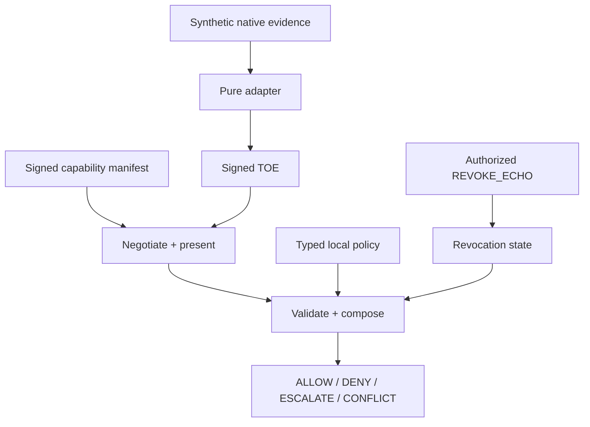

# Reference architecture

The core crate owns the pure protocol operations. The CLI displays an existing
bundle. The simulator drives a deterministic two-agent lifecycle and synthetic
network scenarios. The registry and reference server are intentionally not part
of this MVP.

## Policy model

V1 uses a typed, versioned internal model rather than CEL or Rego:

- `required_claims`: claim class → minimum normalized strength.
- `max_envelope_age_ms`: maximum evidence age.
- `escalation_floor`: insufficient evidence at or above this value escalates;
  lower evidence denies.
- `conflict_delta`: minimum opposing-strength difference that surfaces a
  conflict.

Policies are local. They never alter native evidence verification or the TOE
signature rules. The schema is [`../schemas/policy.schema.json`](../schemas/policy.schema.json).

## Trust model

Concordance trusts no score by default. A relying agent locally chooses trusted
native issuers, adapter publishers, adapter versions, and policies. The protocol
then provides verifiable handling of those chosen inputs: signed TOE integrity,
presenter binding, freshness, declared correlation capping, conflict surfacing,
and authorized revocation.

An adapter’s normalized strength is evidence, not a global truth value. A
receiver that lacks a trusted adapter or cannot verify a required claim must
escalate. The MVP intentionally has no automatic cross-scheme identity linking
or correlation discovery.

## Threat model

The MVP defends against altered TOEs, altered native payloads, stale evidence,
unauthorized revocations, replayed revocations, and declared-source double
counting. It verifies Ed25519 signatures, BLAKE3 commitments, expiry, binding
proofs, issuer equality for revocation, and increasing revocation sequences.

It does not solve malicious native issuers, undisclosed correlation, adapter
publisher compromise, aggregation inference, prompt injection, or network
availability. These remain explicit pilot and hardening work; no current code
claims otherwise.

## Revocation

The issuer of a TOE creates a signed `REVOKE_ECHO` with an increasing sequence
number. The receiver verifies the signer against the TOE, rejects duplicates or
older sequences, records the TOE as revoked, and recomposes every still-active
decision using it. The in-memory MVP demonstrates this behavior; delivery logs,
durable queues, and remote fan-out are federated-pilot work.
